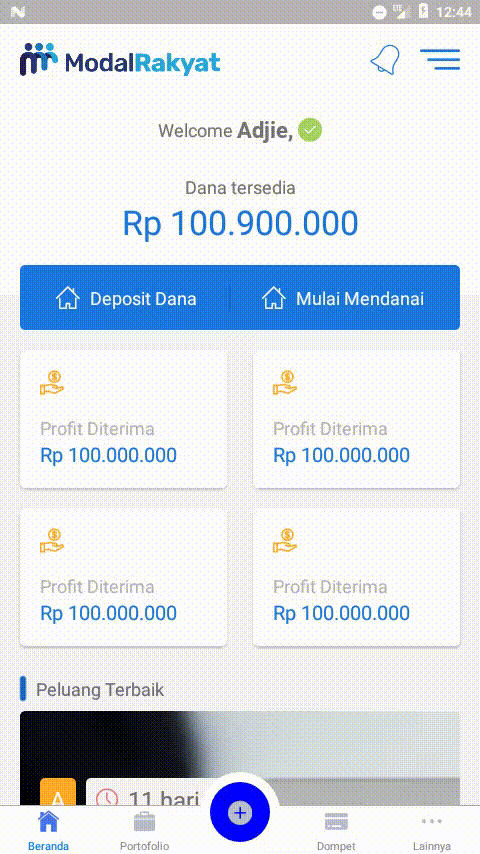

# Invest App

This is mobile app for clonning Modal Rakyat UI and using only learning purpose

## Getting Started

These instructions will get you a copy of the project up and running on your local machine for development and testing purposes.

### Prerequisites

What things you need to install the software

[NPM (Node Package Manager)](https://docs.npmjs.com/downloading-and-installing-node-js-and-npm)

### Installing

Clone the repositori via http or ssh

```
git clone https://github.com/RadiRS/news-app your_app_name
```

```
git clone git@github.com:RadiRS/news-app.git your_app_name
```

Enter into project directory and install all dependencies

```
cd your_app_name && npm install
```

Run the project via command line

```
npm run android   //android
npm run ios       //ios
```

### Demo

<div align="center">
  
  
</div>
&nbsp;
<div align="center">
  
  
</div>

## Running the tests

### Break down into end to end tests

For testing just run script command

```
npm run test
```

## Deployment

### Android

Setup your signed apk by follow [this](https://facebook.github.io/react-native/docs/signed-apk-android) tutorial and run this command

```
npm run build-android
```

## Built With

- [React Native](https://facebook.github.io/react-native/)
- [React Navigation](https://reactnavigation.org/)
- [Redux](https://redux.js.org/)
- [Jest](https://jestjs.io)

## Authors

- **Radi Rusadi** - _Initial work_ - [Github](https://github.com/RadiRs)

## License

This project is licensed under the MIT License - see the [LICENSE.md](LICENSE.md) file for details

## Acknowledgments

- Hat tip to anyone whose code was used
- Inspiration
- etc
